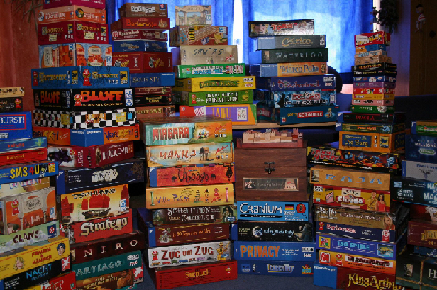

<!SLIDE center transition=fade>
# 待辦事項練習 #

<!SLIDE bullets incremental>
# 持續寫程式才會進步 #

* 我學了 CRUD ，然後可以幹麼…
* 建議找一個功能寫成網站
* 慢慢加入新功能
* 試著找到 gems 幫助你開發新功能

<!SLIDE bullets incremental>
# 我在電腦前準備好了！ #

* ●
* ●
* ●

<!SLIDE center>

##腦袋一片空白，沒有 idea 怎麼辦…

<!SLIDE bullets incremental>
# 建議下手方向

* 自己的興趣
* 覺得很麻煩的事情
* 常用的網站

<!SLIDE center>
# 興趣 #

###遊戲太多，自己寫一個網站來整理遊戲
我發誓這些真的不是我的遊戲

<!SLIDE bullets incremental>
# 常常忘記的事情 #

* 便利貼網站
* 定時提醒

<!SLIDE bullets incremental>
# 每天都會上去瀏覽的網站

* 挑一些功能自己重刻
* 大功能要拆成小功能來實作